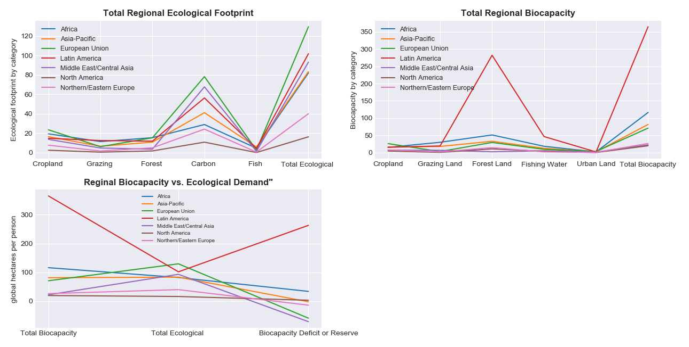

# Global Ecological Footprint and Biocapacity

## Introduction

Ecological Footprint measures the ecological resources that a given population uses (demand side).  Biocapacity represents an ecosystem’s capacity to provide natural resources and absorb waste generated by humans(supply-side). 
- They are measured by considering a region’s supply capacity and demand in these categories: croplands, grazing lands for animal products, forested areas to produce wood products, marine areas for fisheries, built-up land for housing and infrastructure, and forested land needed to absorb carbon dioxide emissions from energy consumption.
- Both the Ecological Footprint and biocapacity are expressed in global hectares—globally comparable, standardized hectares with world average productivity.
- A region is considered ecologically deficit when the footprint exceeds its biocapacity (they relay on trade, or liquidate their resources i.e. overfishing).
- It’s considered to have an ecological reserve when it's biocapacity exceeds its footprint. 

### Motivating Questions 

* Which countries are ecologically deficit?
* Which countries have ecological reserves?
* Is population growth correlated to a higher ecological footprint?
* How about the relationship between GDP per capita and the countries ecological footprint?

## Dataset 

I found the countries.csv data from Kaggle. The dataset was from 2016 and was updated 3 years ago.  It was originally provided by the Global Footprint Network. 

* sums five categories to track a country's ecological footprint: cropland footprint, grazing footprint, fish footprint, built-up (or urban) land, and carbon demand on land.
* sums five categories to track a country's biocapacity: cropland land, grazing land, fishing water, forest area, and urban land.
* the ecological footprint was subtracted from the biocapacity to determined if a country is ecologially deficit or has reserves. 
* 21 columns of data with a mixture of floats and strings
* 188 rows (188 countries)
* filling null values and conversion of column datatype was needed.
* I also deleted some countries with a lot of missing data. The final cleaned dataset contained 171 countries. 

####Data Source 
* https://www.kaggle.com/footprintnetwork/ecological-footprint

## Exploratory Data Aanlysis

### Biocapacity and Ecological Footprint by Country
For the heat maps to help visualizet the data better I eliminated three outliers. 

The heat map below represents the biocapacity of countries in my dataset. 

- It seems that South America has the hightest number of countries whose biocapacity is greater than its population’s Ecological Footprint. Let's look indepth at each of the categories by region.  

####Observations 

- One reason Latine America has the greatest biocapacity of all the regions is due to it's large forest land. 

- The Europian region has the biggest ecologial footprint. 

- Countries in regions of Middle East/Central Asia, European Union, Northern/Easern Europe,European Union, Asian-Pacific have biocapacity have exceeded the regions biocapacity and are ecologically deficit. 

heat map of ecological footprint by country

heap map of biocapacity by country 

heatmap map ecologial def or reserves 

look into regions 

look into top 5 countries with def and top 5 with res. 

compare population or gdp 

# global_ecological_footprint
