# Global Ecological Footprint and Biocapacity

## Introduction

Ecological Footprint measures the ecological resources that a given population uses (demand side). Biocapacity represents an ecosystem’s capacity to provide natural resources and absorb waste generated by a given population(supply-side).
- They are measured by considering a region’s supply capacity and demand in these categories: croplands, grazing lands for animal products, forested areas to produce wood products, marine areas for fisheries, built-up land for housing and infrastructure, and forested land needed to absorb carbon dioxide emissions from energy consumption.
- Both the Ecological Footprint and biocapacity are expressed in global hectares(gha), which measures productive surface area.
- A region is considered ecologically deficit when the footprint exceeds its biocapacity (they relay on trade, or liquidate their resources i.e. overfishing).
-It’s considered to have an ecological reserve when it's biocapacity exceeds its footprint.

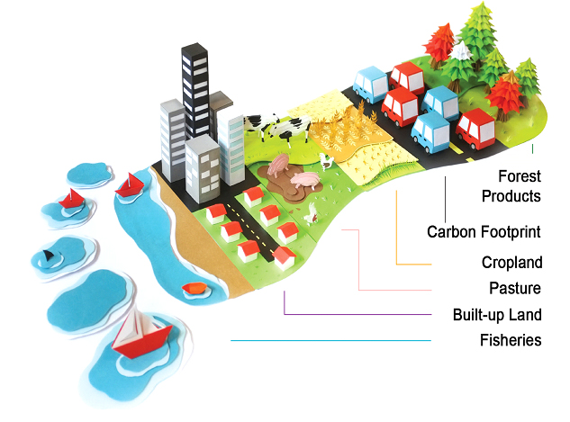

### Motivating Questions 

* Which countries/regions run an ecological deficit?
* Which countries/regions have ecological reserves?
* Is population growth correlated to a higher ecological footprint?
* How about the relationship between GDP per capita and the countries ecological footprint?

## Dataset 

I found the countries.csv data on Kaggle. The dataset was from 2016 and was updated 3 years ago. It was originally provided by the Global Footprint Network.

* Sums five categories to track a country's ecological footprint: cropland footprint, grazing footprint, fish footprint, built-up (or urban) land, and carbon demand on land.
* sums five categories to track a country's biocapacity: cropland land, grazing land, fishing water, forest area, and urban land.

* The Ecological Footprint was subtracted from the biocapacity to determined if a country is ecologically deficit or has reserves.
* 21 columns of data with a mixture of floats and strings
* 188 rows (188 countries)
* filling null values and conversion of column datatype was needed.
* I also deleted some countries with a lot of missing data. The final cleaned dataset contained 171 countries. 

* I also obtained another world.countries dataset from Kaggle to create heatmaps using geographical coardinates. 

## Data Sources
* https://www.kaggle.com/footprintnetwork/ecological-footprint

# https://www.kaggle.com/ktochylin/world-countries

sources used to fill NaN values
* https://en.wikipedia.org/wiki/List_of_countries_by_GDP_(PPP)_per_capita#References
* https://en.wikipedia.org/wiki/List_of_countries_by_Human_Development_Index

## Exploratory Data Analysis

### Biocapacity and Ecological Footprint by Country

Question: Which countries/regions are ecologically deficit? Or have reserve?
* To arrange the scaling and help visualize the data better by country I eliminated these 3 outlier countries from the maps below. 
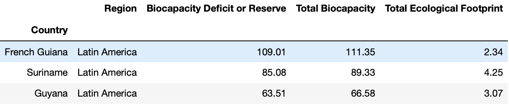

First I want to look at a country's Biocapacity level per person. This map shows the total Biocapacity of a country per person.
  
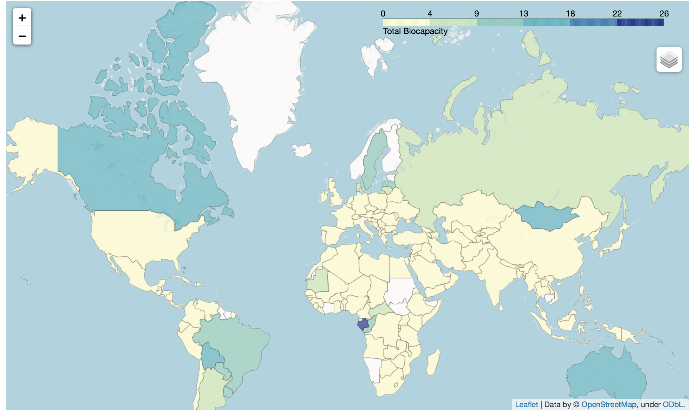

Many of the countries have a really low Biocapacity level, they fall within the ranges of 0 to 4 global hectors. The rest have ranges of 4 to 18. Gabon's Biocapacity is between 22 to 26. The three outlier country's Biocapacity is ranged from 66- 111 gha.

The map below shows the Ecological Footprint of a country per person. 
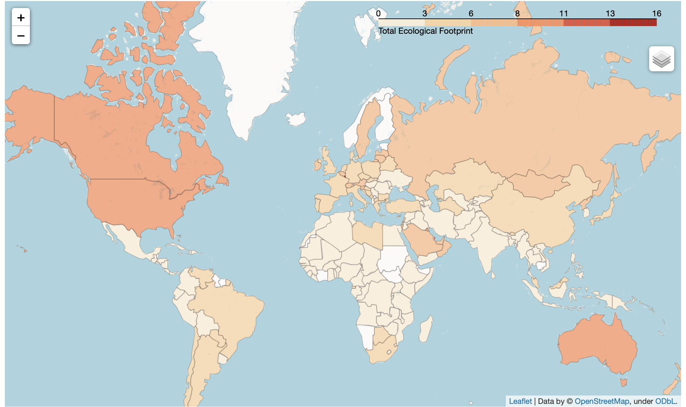
Many countries in North America have a high Ecological Footprint compared to other regions. Countries in Africa have the lowest Ecological Footprint.

Many of the country’s Ecological Footprint is in the range of 0 to 11 global hectors. Some limited countries such as Luxembourg have footprints as high as 16gha.
* The countries with Ecological Footprint that range from 11 to 16gha are too small to see on the map without zooming.

Map of countries that are ecologically deficits or have reserves
* deficit or reserve = Biocapacity - Ecological Foot
 

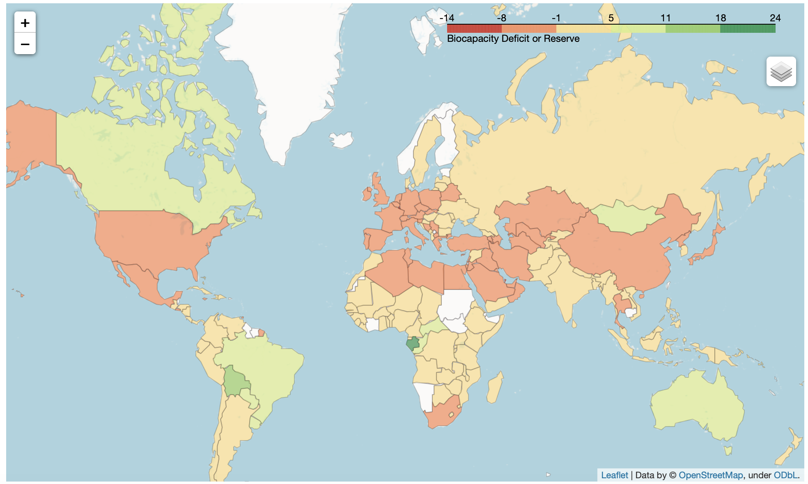

Many countries have reserves that range from 0 to 5. Followed by a number of countries who are experiencing a biocapacity deficit that ranges from -1 to -8.

* It seems that Latin America has the highest number of countries whose Biocapacity is greater than its population’s Ecological Footprint. Let's look in- depth at each of the categorical measurements by region. 

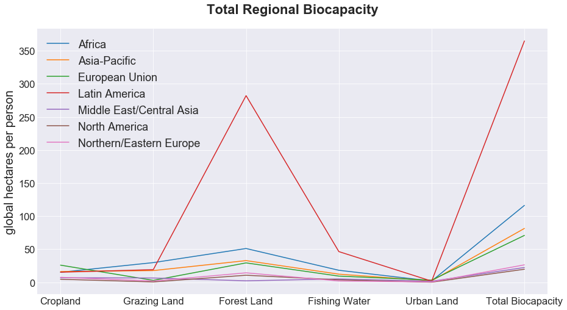

This graph sums the biocapacity in each of the productive surface areas per region. Since this is per region the three outlier countries are included.
* One reason Latine America has the highest number of countries who have ecological reserve is due to its large forest land area per person.
* Latine America also has the largest fishing capacity.

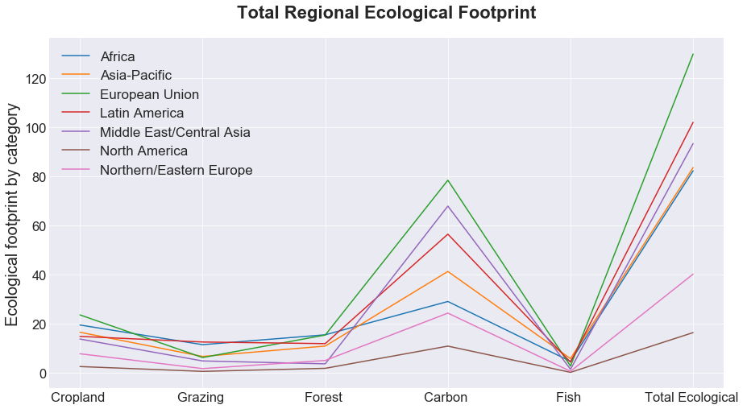
- Most of the regions Ecological footprint comes from carbon emissions. They all peak at carbon.
- The Europian Union has the biggest Ecological Footprint and carbon emissions, even though, as seen from the graph above, it's biocapacity is not very high. 

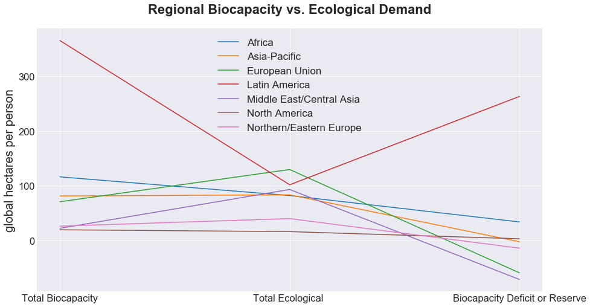
- 4 regions are below zero. 
- Middle East/ Central Asia is the most ecologically deficit region. 
- Most of the countries in the regions of Middle East/Central Asia, European Union, Northern/Easern Europe,European Union, Asian-Pacific have exceeded the region’s biocapacity and are ecologically deficit.

Latin America's high Biocapacity reserve or Biological capacity doesn't necessarily mean that it has the highest productive surface area out of all the regions. It means it has the highest productive surface area per person. So does population increase lead to an increase in Ecological Footprint? Is there another factor that yields a stronger correlation?

## Population vs. GDP per capita 

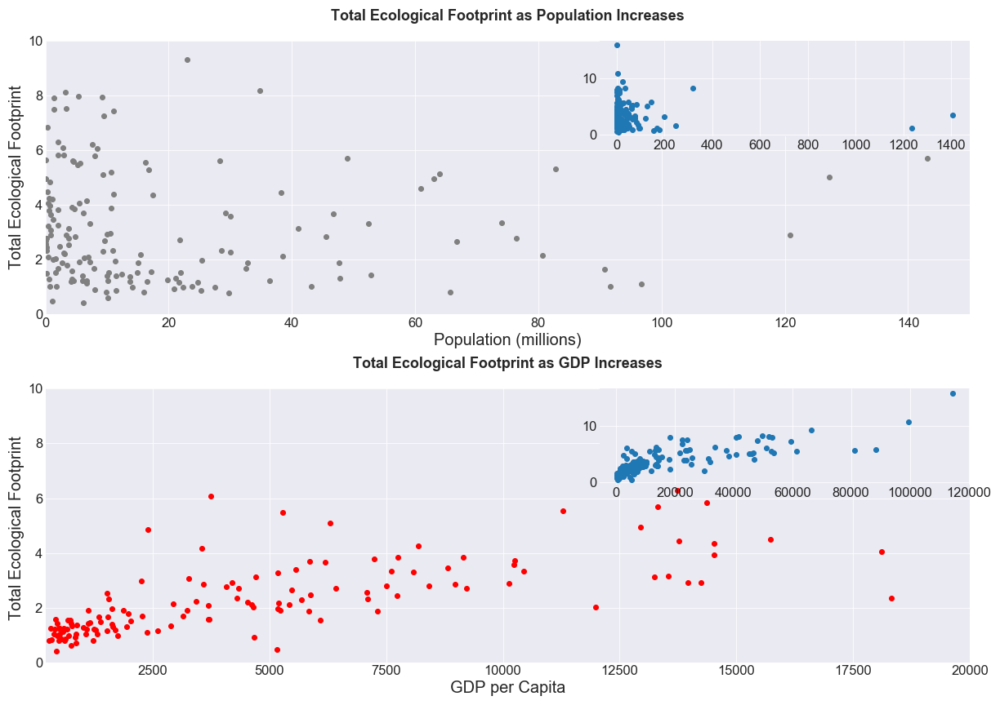
Since most of the countries have a population of less than 150 million, the graph is plotted to reflect those countries. The subplot inside includes all the countries in the dataset. The same with the GDP per capita, countries that have GDP up to 20000 are reflected in the graph, with all the countries included in the subplot.

* There is no strong trend that is observed for the Ecological Footprint as the population increases.
* For GDP however, there is a trend forming. The Ecological Footprint gradually increases as the GDP increases. The subplot also clearly reflects this positive correlation.

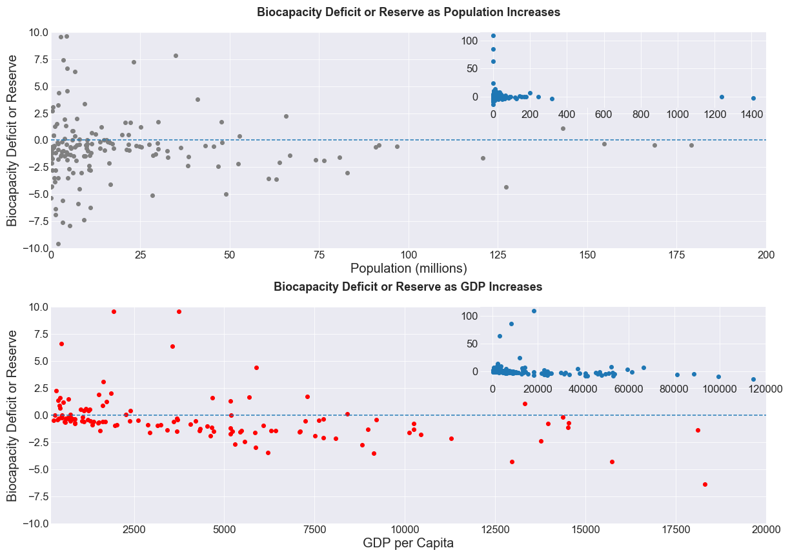

A very small trend is observed for the Biocapacity deficit or reserve as population increases. It seems countries that have larger than 50 million people are mostly in the Biocapacity deficit side.
* However, what’s interesting about this graph is that most countries have less than 25 million people. And more than half of these countries are located on the Biocapacity deficit side than the reserve.
* If population increase was strongly correlated to ecological footprint, I believe more of these countries would have ecological reserves.

For the second graph a stronger correlation is reflected. There is a visible trend of more ecologically deficit countries as the GDP increases. 

## Conclusion 
Several things were answerd from this analysis:

* most of the countries that have ecological reserve are located in Latin America. 

* Middle East/ Central Asia is the most ecologically deficit region. 

* The European Union has the biggest Ecological Footprint.

* When comparing the Ecological Footprint of population increase vs. GDP increase by countries, the results showed countries start to have higher ecological footprint as their GDP increases. There is a signficantly stronger relationship between Ecological Footprint and GDP, than the population. 

If you are curious the following tables contain the top ten countries that have ecological deficit and reserve. 

A table of top ten ecologically deficit countries 
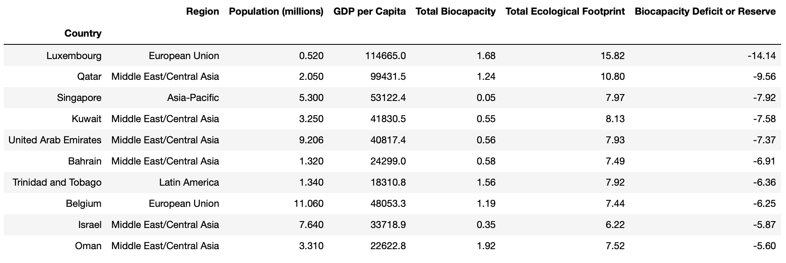

A table of top ten countries with ecological reserve 
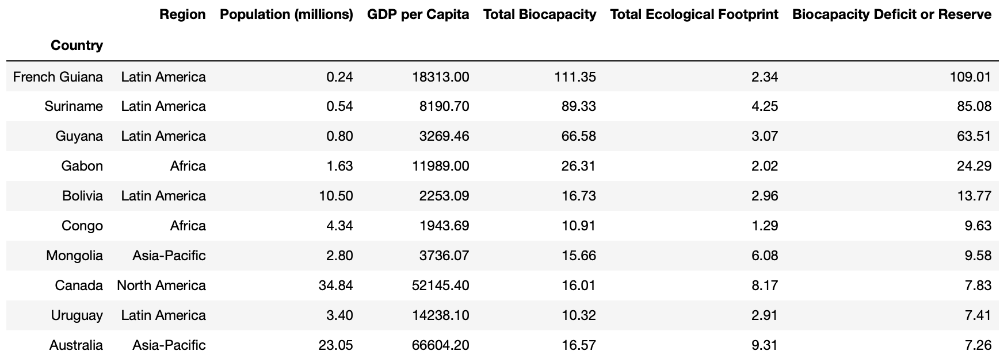

